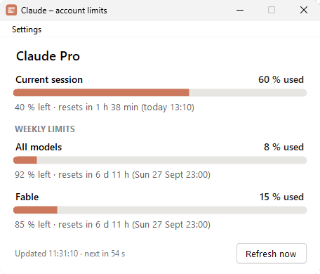
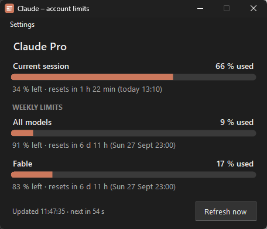

# ClaudeUsage

A small Windows tray app that shows the remaining usage limits of the Claude account you are signed in to with [Claude Code](https://code.claude.com): the current session window and the weekly limits (all models plus per-model limits such as Fable), each with the time of the next reset.

<p>
  
  
</p>

It reads the same data Claude Code shows in `/usage`, so the numbers match the terminal, but you can keep them on screen (or in the tray tooltip) while you work.

This is an unofficial tool for developers and other technical users. It is not affiliated with or endorsed by Anthropic.

## Features

- **Current session**: percent used, percent left, reset time (relative and absolute).
- **Weekly limits**: *All models* plus one row per model-scoped limit. Rows are built from the API response, so new per-model limits show up without an update.
- Auto-refresh every 5 minutes by default (Settings → Refresh interval: 3–30 minutes), plus a manual refresh button. On HTTP 429 the app keeps the last values and backs off automatically.
- **System tray icon** with a tooltip listing all percentages. Minimizing hides the window to the tray; left-click the icon to bring it back, right-click for a menu.
- **English and Czech UI** (Settings → Language). The default follows the Windows display language.
- **Light and dark theme** (Settings → Theme). The default follows the Windows app mode and switches live when Windows does.
- **Text size** from 100 % to 150 % (Settings → Text size), on top of the monitor's DPI scaling.
- Always-on-top toggle.
- Zero configuration: it reuses the Claude Code login.

## Requirements

- Windows 10 or 11, x64.
- [.NET 10 Desktop Runtime](https://dotnet.microsoft.com/download/dotnet/10.0). The binary is framework-dependent; installing the runtime is your responsibility. If it is missing, Windows shows a dialog with a download link.
- Claude Code installed and signed in with a Claude subscription (Pro or Max). The app reads `%USERPROFILE%\.claude\.credentials.json`, which Claude Code writes on Windows.

API-key logins (`ANTHROPIC_API_KEY`) have no subscription limits, so there is nothing to show for them.

## Download

Get `ClaudeUsage.exe` from the [latest release](https://github.com/AntoninPrazsky/ClaudeUsage/releases/latest) and run it. A SHA-256 checksum file is attached next to the binary.

The executable is not code-signed, so Windows SmartScreen may warn on first run (*More info* → *Run anyway*). If you would rather not run a downloaded exe, build it from source; the whole app is about a thousand lines of C#.

## How it works

1. Reads the OAuth access token from `%USERPROFILE%\.claude\.credentials.json`.
2. Calls the endpoint behind Claude Code's `/usage` command:

   ```
   GET https://api.anthropic.com/api/oauth/usage
   Authorization: Bearer <accessToken>
   anthropic-beta: oauth-2025-04-20
   ```

3. Renders the `limits` array (`session`, `weekly_all`, `weekly_scoped`), falling back to the older `five_hour` / `seven_day` fields if the array is missing.

This endpoint is undocumented and used internally by Claude Code; Anthropic may change it at any time.

### Rate limit

The endpoint is rate limited per access token, and the limit is neither documented nor announced in headers: a throttled request gets HTTP 429 with `Retry-After: 0` and no `x-ratelimit-*` headers (see [anthropics/claude-code#30930](https://github.com/anthropics/claude-code/issues/30930)). Polling every minute is enough to hit it. Measured with this app on 2026-09-21: once throttled, the endpoint let through exactly one request every 150 seconds (24 per hour per token), which looks like a token bucket refilling at that rate. Anything faster than that eventually stalls; a manual refresh and every app start use one request too. The budget belongs to the login token, so anything else that calls the endpoint with the same login (a second instance of this app, a statusline script) draws from the same 24 requests per hour.

The app therefore checks every 5 minutes by default (Settings → Refresh interval, 3–30 minutes). When a check returns 429 it keeps showing the last values, marks the status line, and doubles the wait for every consecutive 429 (up to 30 minutes). Do not expect real-time numbers: the data only changes with your own Claude usage anyway.

### Token refresh

Access tokens expire after roughly 8 hours. When the token is expired, or the API returns 401, the app refreshes it with the stored refresh token at `https://platform.claude.com/v1/oauth/token`, using the same OAuth client ID as Claude Code, and writes the new tokens back to `.credentials.json` in the same format. Claude Code keeps working with the same login.

If the refresh fails (for example the refresh token expired too; those last about three weeks), the app shows a message. Running `claude` in a terminal signs in again, and the app picks the new login up on its next refresh.

### Privacy

- Network access is limited to `api.anthropic.com` and `platform.claude.com`. There is no telemetry.
- The only files touched are `.credentials.json` (read on every refresh, written only when a token is refreshed) and the app's own `%APPDATA%\ClaudeUsage\settings.json`.

## Settings

Preferences live in `%APPDATA%\ClaudeUsage\settings.json`:

```json
{
  "Language": "auto",
  "TopMost": false,
  "Theme": "auto",
  "Scale": 100,
  "RefreshSeconds": 300
}
```

`Language` is `auto` (follow Windows), `cs` or `en`. `Theme` is `auto` (follow the Windows app mode), `light` or `dark`. `Scale` is the text size in percent; the menu offers 100–150, the file accepts 50–300. `RefreshSeconds` is the time between two usage checks; the menu offers 180–1800, the file accepts 30–86400 (values under 150 will hit the rate limit, see above).

## Build from source

Requires the .NET 10 SDK.

```
git clone https://github.com/AntoninPrazsky/ClaudeUsage.git
cd ClaudeUsage
dotnet publish -c Release -r win-x64 -p:SelfContained=false -p:PublishSingleFile=true -o publish
```

The result is `publish\ClaudeUsage.exe` (about 230 kB). For a self-contained build that does not need the runtime installed (about 100 MB), pass `-p:SelfContained=true` instead.

For development, the environment variable `CLAUDEUSAGE_USAGE_URL` points the app at another URL (for example a local mock server that returns a saved response), which avoids burning the real endpoint's rate limit while working on the UI.

Releases are built by GitHub Actions from the tagged commit (`.github/workflows/build.yml`). Pushing a `v*` tag publishes a release with the binary and its checksum.

## Project layout

| File | Purpose |
|---|---|
| `Program.cs` | Entry point |
| `MainForm.cs` | Window, menu, tray icon, timers, rendering |
| `LimitRow.cs` | One limit row (name, percentage, bar, reset time) |
| `Localization.cs` | UI strings in English and Czech |
| `Theme.cs` | Light/dark palettes, themed menu renderer, dark title bar |
| `AppSettings.cs` | Preferences in `%APPDATA%\ClaudeUsage\settings.json` |
| `UsageClient.cs` | API calls and token refresh |
| `UsageParser.cs` | JSON response to limit objects |
| `CredentialStore.cs` | Reading and writing `.credentials.json` |
| `Models.cs` | Data types |
| `app.ico` | Application icon |

## License

[MIT](LICENSE)
